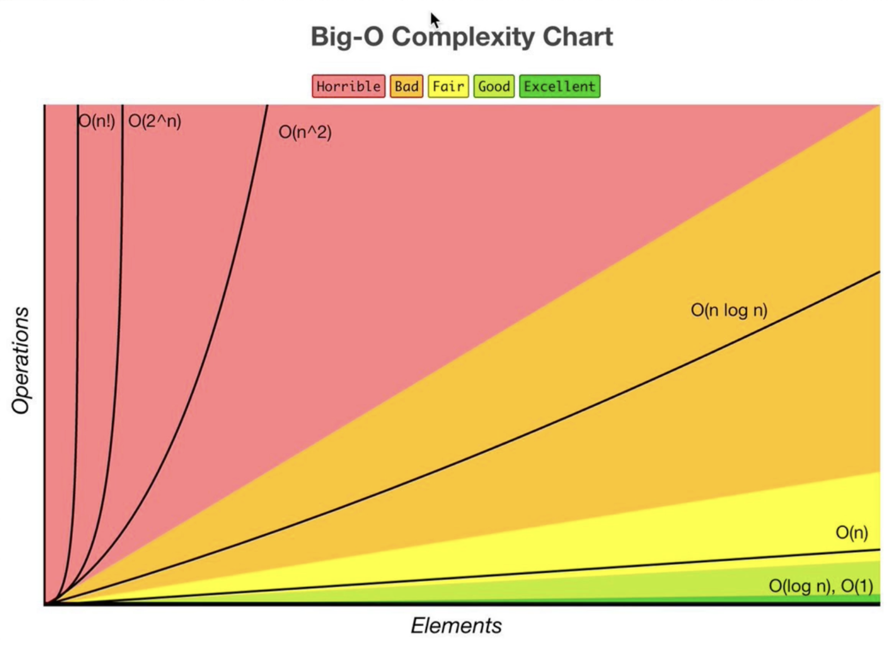

# Overview

  

## Data Structures

- Arrays
- Stacks
- Queues
- Linked Lists
- Trees
- Tries
- Graphs
- Hash Tables

## Algorithms

- Sorting
- Dynamic Programming
- BFS + DFS (Searching)
- Recursion

## Operations On Data Structure

- Insertion
- Deletion
- Traversal
- Sorting
- Access
