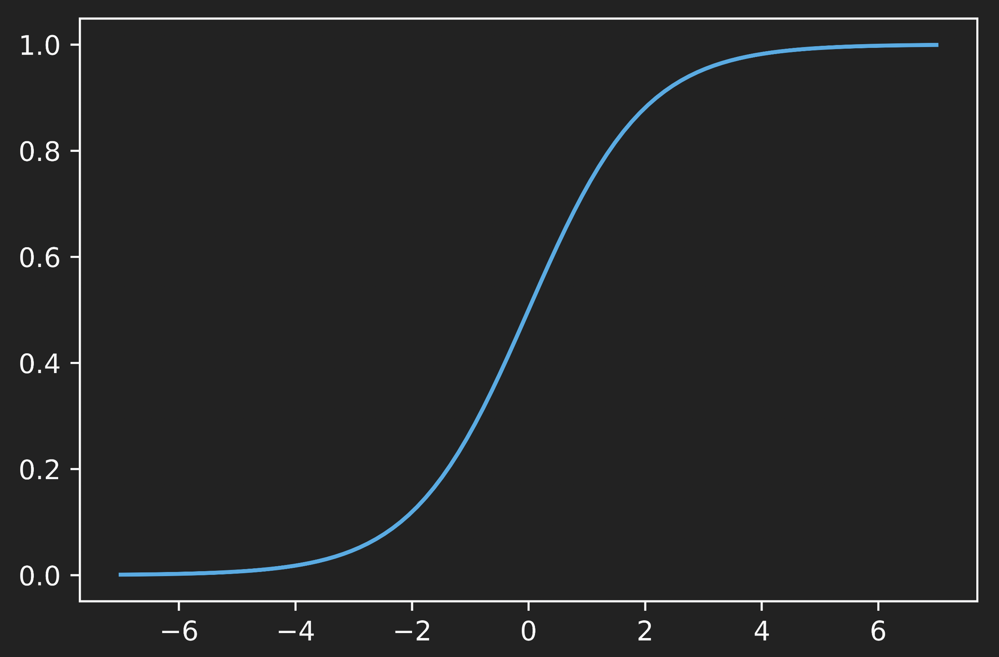

# Classification

$ class=category $

sigmoid function (outputs between $ 0 $ and $ 1 $)

$$
0 < g(z) = \frac{1}{1 + e ^{-z}} <1
$$

---

**regression model**:

$$
\begin{align*}
f _{\vec{w}, b} ( \vec{x}) &= g (\underbrace{ \vec{w} \cdot \vec{x} + b } _{z})\\
&= \frac{1}{e ^{-(\underbrace{ \vec{w}\cdot \vec{x} + b } _{z})}}
\end{align*}
$$

"probability" that a class is $ 1 $

---

$$
\begin{align*}
&f _{\vec{w}, b}\\
&f _{\vec{w}, b} = P(y = 1 | \vec{x}, \vec{w}, b)\\
\end{align*}
$$

$ \vec{x} $: input
$ \vec{w}, b $: parameters

  

**when is $ f _{\vec{w}, b}(\vec{x}) \ge 0.5 $ (threshold)**?
$$
\begin{align*}
g(z) &\ge 0.5\\
z &\ge 0\\
\vec{w} \cdot \vec{x} + b &\ge 0\\
\hat{y} & = 1
\end{align*}
$$

## Decision Boundary

$$
\text{Decision Boundary: } z = \vec{w} \cdot \vec{x} + b = 0
$$

## Cost Function

the squared error cost for logistic regression is not a convex

$$
\begin{align*}
\text{loss:  } L (f _{\vec{w}, b}(x ^{(i)}, y ^{(i)})) =
\begin{cases}
-\log(f _{\vec{w}, b}(\vec{x} ^{(i)})) &\text{ if } y ^{(i)} = 1\\
-\log(1-f _{\vec{w}, b}(\vec{x} ^{(i)})) &\text{ if } y ^{(i)} = 0\\
\end{cases}
\end{align*}
$$

Therefore, the cost function for logistic regression

---

$$
\begin{align*}
\text{cost: }J (\vec{w}, b) &= \frac{1}{m}
\sum_{i=1}^{m} \underbrace{ L \left( f _{\vec{w}, b}( \vec{x} ^{(i)}, y ^{(i)}) \right) } _{loss}\\
\text{where loss: }& L \left( f _{\vec{w}, b}( \vec{x} ^{(i)}, y ^{(i)}) \right) =
\begin{cases}
-\log(f _{\vec{w}, b}(\vec{x} ^{(i)})) &\text{ if } y ^{(i)} = 1\\
-\log(1-f _{\vec{w}, b}(\vec{x} ^{(i)})) &\text{ if } y ^{(i)} = 0\\
\end{cases}
\end{align*}
$$

---

==50min==

### Cost Function Implementation

$$
\begin{align*}
L(f _{\vec{w}, b} (\vec{x}& ^{(i)}), y ^{(i)}) =\\
&-y ^{(i)} \log(f _{\vec{w}, b}(\vec{x} ^{(i)})) - (1-y^{(i)})
\log(1 - f_{\vec{w}, b}(\vec{x} ^{(i)}))
\end{align*}
$$

therefore the cost function

$$
\begin{align*}
J(\vec{w}, b) &= \frac{1}{m} \sum_{i=1}^{m}
\left[ L(f _{\vec{w}, b}(\vec{x} ^{(i)}), y ^{(i)}) \right]\\
&=-\frac{1}{m} \sum_{i=1}^{m}
\left[
    y ^{(i)} \log(f _{\vec{w}, b} (\vec{x} ^{(i)})) + (1 - y ^{(i)})
    \log(1 - f _{\vec{w}, b} ( \vec{x} ^{(i)}))
\right]
\end{align*}
$$

## Gradient Descent

recall that the cost function:

$$
J(\vec{w}, b)=-\frac{1}{m} \sum_{i=1}^{m}
\left[
    y ^{(i)} \log(f _{\vec{w}, b} (\vec{x} ^{(i)})) + (1 - y ^{(i)})
    \log(1 - f _{\vec{w}, b} ( \vec{x} ^{(i)}))
\right]
$$

---

**gradient descent implementation:**

repeat
$$
\begin{align*}
w _{j} &= w _{j} - \alpha \frac{\partial }{\partial w _{j}} J (\vec{w}, b)\\
b &= b - \alpha \frac{\partial }{\partial b} J (\vec{w}, b)\\
\end{align*}
$$

where

$$
\begin{align*}
\frac{\partial }{\partial w _{j}} J ( \vec{w}, b) &= \frac{ 1}{m}
\sum_{i=1}^{m}
\left( f _{\vec{w}, b} (\vec{x} ^{(i)}) - y ^{(i)} \right) x _{j} ^{(i)}\\
\frac{\partial }{\partial b} J ( \vec{w}, b) &= \frac{ 1}{m}
\sum_{i=1}^{m}
\left( f _{\vec{w}, b} (\vec{x} ^{(i)}) - y ^{(i)} \right)
\end{align*}
$$

---

Notice that the definition for $ f _{\vec{w}, b}(\vec{x}) $ is different for Linear regression and Logistic regression

$$
\begin{align*}
\text{Linear regression:}\quad&f _{\vec{w}, b} (\vec{x}) = \vec{w} \cdot \vec{x} + b\\
\text{Logistic regression:}\quad&f _{\vec{w}, b} (\vec{x}) =
\frac{1}{1 + e ^{-(\vec{w} \cdot \vec{x} + b)}}
\end{align*}
$$
