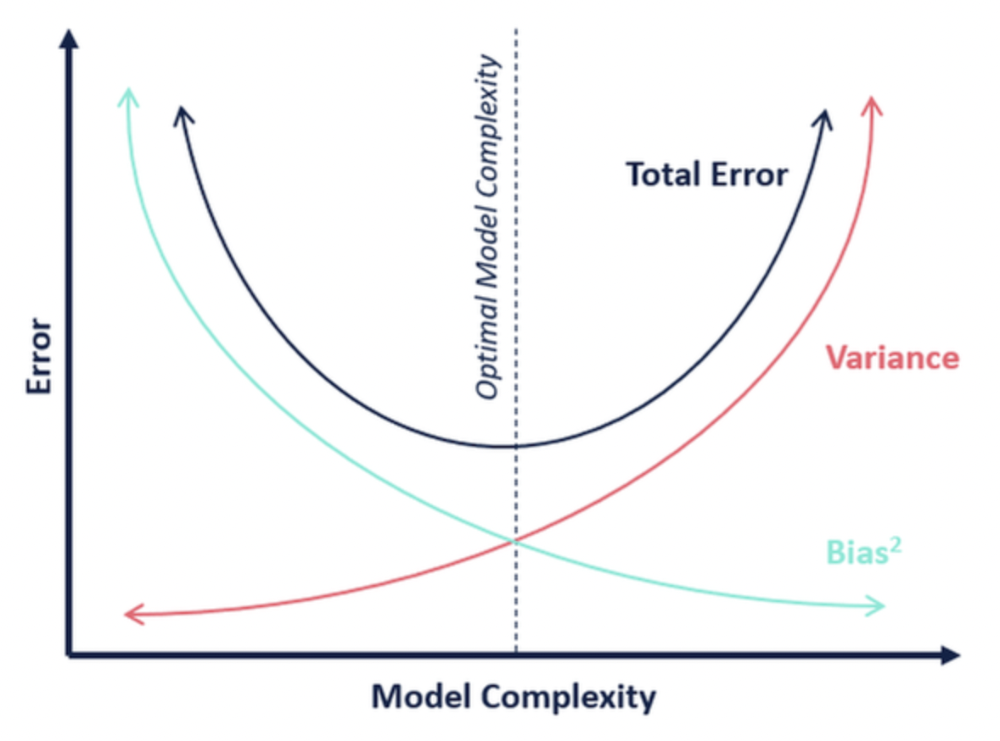

# MidTerm

## 1. Residual sum of squares, gradient iterations, normal-

You must be able to explain the residual sum of squares criterion associated to the linear regression model. You must be able to derive the gradient iterations on that criterion as well as the closed form solution for the regression coefficients (obtained by setting the derivatives to zero).

**Residual sum of squares**: RSS

$$
RSS = \sum_{i=1}^{n} ( y ^{i} - f(x ^{i})) ^{2}
$$

Our loss function
**OLS**: ordinary least squares

$$
J (\beta )= \frac{1}{2N} \sum_{i=1}^{N} (t ^{(i)} - h(x ^{(i)})) ^{2}
$$

**Gradient iterations on RSS**:

$$
\begin{align*}
\frac{\partial J}{\partial \beta _{k} } &= \frac{\partial }{\partial \beta _{k}} \frac{1}{2N} \sum_{i=1}^{N} \left( t ^{(i)} -\left( \beta _{0} + \beta _{1} x ^{(i)} _{1} + \dots + \beta _{D} x ^{(i)} _{D} \right) \right) ^{2}\\
&= \frac{1}{N} \sum_{i =1}^{N} \left( t ^{(i)} - \left( \beta _{0} + \beta _{1} x ^{(i)} _{1} + \dots + \beta _{D} x ^{(i)} _{D} \right) \right) \cdot (- \tilde{ x _{k}  }^{(i)} )\\
&= \frac{1}{N} \sum_{i =1}^{N} \left( t ^{(i)} - h(x ^{(i)}) \right) \cdot (- \tilde{ x _{k}  }^{(i)} )
\end{align*}
$$

**Batch gradient descent**:

For $ iter < maxIter $

$$
\beta = \beta - \eta \sum_{i=1}^{N}(t ^{(i)} - h _{\beta }(x ^{(i)}))(-\tilde{ x } ^{(i)})
$$

**Stochastic Gradient Descent**:

For $ epoch < MaxNumEpochs $

reshuffle the set $ \left\{ t ^{(i)}, x ^{(i)} \right\} _{i =1} ^{N} $

For $ i \in [1,\dots, N] $

$$
\beta = \beta - \eta \left( t ^{(i)} - h _{\beta} (x ^{(i)}) \right) (- \tilde{ x } ^{(i)} )
$$

> Todo: code implementation

**Closed for solution**:

$$
\begin{align*}
\beta &= (\tilde{ X } ^{\top}\tilde{ X })^{-1}\tilde{ X }^{\top}\\
\text{where } \tilde{ X } &=
\begin{bmatrix}
1 &x _{1} ^{(1)} &x _{2} ^{(1)} &\dots & x _{D} ^{(1)}\\
1 &\vdots &\vdots &\vdots &\vdots\\
1 &x _{1} ^{(N)} &x _{2} ^{(N)} &\dots &x _{D} ^{(N)}
\end{bmatrix}
\end{align*}
$$

_Derivation_:

> Todo: derivation

## 2./4. Regularization Approaches, comparison

You must be able to list and explain the three main regularization approaches (Ridge, Lasso, Best Subset Selection)

- Best Subset Selection
- Ridge
- Lasso

### Best Subset Selection

Find the optimal subset of the features

$ \rightarrow $ Total numbers $ \begin{pmatrix} D\\k \end{pmatrix} $ for every $ k=1,\dots,D $
For each subset:

1. Fit the model to the dataset
2. Evaluate trained model on same new (test) dataset
3. Select the subset of the features that gives the best prediction error

We can select the best model through cross validation ($ k $ fold cross validation)

1. split the data set into $ k $ bins
2. for each $ i= 1,\dots, k $ train the model on all the bins but the $ i ^{th} $ one and evaluate it on the $ k ^{th} $ bin
3. the error for this model if the mean error for each $ i=1,\dots,k $

_Leave-one-out_ cross validation:
Train the model on $ D $ but one example and evaluate $ h _{\beta } $ on the remaining example.
The error for the $ i ^{th} $ example
$$
MSE _{i} = (t ^{i} - h _{\beta } ^{i=k}(x ^{(i)})) ^{2}
$$
The **Cross Validation Error**:
$$
error _{CV} = \frac{1}{N} \sum_{i=1}^{N} MSE _{i}
$$

### Ridge & Lasso

**loss function**:

$$
\begin{align*}
l _{Ridge}(\beta ) &= \frac{1}{N} \sum_{i=1}^{N} ( t ^{(i)} - \beta ^{\top}\tilde{ x }^{(i)}) ^{2}
+\lambda \underbrace{ \sum_{j=1}^{D} \left| \beta _{j} \right| ^{2} } _{\text{start from }j = 1}\\
l _{LASSO} (\beta ) &= \frac{1}{N} \sum_{i=1}^{N}
(t ^{(i)} - \beta ^{\top}\tilde{ x }^{(i)}) ^{2} +
\lambda \sum_{i=1}^{D} \left| \beta _{j} \right|
\end{align*}
$$

#### Ridge

---

$$
\text{grad} _{\beta } l _{Ridge} =
(\underline{\underline{X}}^{\top}\underline{\underline{X}}+ \lambda I) ^{-1}
\underline{\underline{X}} ^{\top} \tilde{ t }
$$

---
**closed form solution:**
$ \rightarrow $ complexity:
Ridge can be solved through gradient descent (differentiable everywhere).
If fact, we can use the Normal Equation for Linear Regression on Ridge Regression to solve for $ \beta _{Ridge} $ (regression vector that minimizes the Ridge loss)

#### LASSO

For LASSO, not that $ \left| \beta _{j} \right| $ is not differentiable as zero

$ \rightarrow $ gradient descent will not work
$ \rightarrow $ $ \beta _{LASSO} $ cannot be obtained from solving a linear system (like OSE and Ridge)
$ \rightarrow $ However, LASSO will be better at performing feature selection

## 3. Statistical Intuition

You must be able to explain the statistical assumptions leading to the residual sum of squares model, Ridge and Lasso. You must be able to describe the distributions involved in each regularization approach (Gaussian and Laplace).

### Residual sum of squares

**Assume**:

1. $ t ^{(i)}= \beta ^{\top}\tilde{ x } ^{(i)} + \varepsilon ^{(i)} $
2. $ \varepsilon ^{(i)} \sim N (0, \sigma ) $
3. $ \varepsilon ^{(i)} $'s are independent

the only randomness in $ t ^{(i)} $'s is due to $ \varepsilon ^{(i)} $, therefore, the probability of observing a particular $ t^{(i)} $ is given by

$$
\begin{align*}
p(t ^{(i)}) =& p(\varepsilon ^{(i)} = t ^{(i)} - \beta ^{\top}\tilde{ x } ^{(i)}  )\\
=& \frac{1}{\sqrt{2\pi}\sigma }
\exp\left(\frac{-(\varepsilon ^{(i)})^{2}}{2 \sigma ^{2}}\right)\\
=& \frac{1}{\sqrt{2\pi}\sigma }
\exp\left(\frac{-(t ^{(i)}-\beta ^{\top}\tilde{ x } ^{(i)} )^{2}}{2 \sigma ^{2}}\right)\\
\end{align*}
$$

Therefore we have:

$$
\begin{align*}
p\left(\left\{ t ^{(i)} \right\} _{i=1} ^{N}| x ^{(i)} \right) &= \prod _{i=1} ^{N}  p(t ^{(i)})\\
&= \prod _{i=1}^{N} \frac{1}{\sqrt{2\pi}\sigma }
\exp\left(\frac{-(t ^{(i)}-\beta ^{\top}\tilde{ x } ^{(i)} )^{2}}{2 \sigma ^{2}}\right)\\
\end{align*}
$$

taking log to simplify we have

$$
\beta _{MLE} = \text{argmin} \sum_{i=1}^{N} \frac{(t ^{(i)}- \beta ^{\top} \tilde{ x }^{(i)}) ^{2}}
{2 \sigma ^{2}}
$$

### Ridge & Lasso

**loss function**:

$$
\begin{align*}
l _{Ridge}(\beta ) &= \frac{1}{N} \sum_{i=1}^{N} ( t ^{(i)} - \beta ^{\top}\tilde{ x }^{(i)}) ^{2}
+\lambda \underbrace{ \sum_{j=1}^{D} \left| \beta _{j} \right| ^{2} } _{\text{start from }j = 1}\\
l _{LASSO} (\beta ) &= \frac{1}{N} \sum_{i=1}^{N}
(t ^{(i)} - \beta ^{\top}\tilde{ x }^{(i)}) ^{2} +
\lambda \sum_{i=1}^{D} \left| \beta _{j} \right|
\end{align*}
$$

### Statistical Motivation for Ridge and Lasso

>- Prior: a prior probability distribution, often simply called the prior, of an uncertain quantity is the probability distribution that would express one's beliefs about this quantity before some evidence is taken into account.
>- Posterior: posterior probability is a type of conditional probability in Bayesian statistics. In common usage, the term posterior probability refers to the conditional probability $ P(A|B) $ of an event $ A $ given $ B $ which comes from an application of Bayes' theorem
>$$
>P(A|B) = \frac{P(B|A)P(A)}{P(B)}
>$$
>- MAP: maximum a posterior probability
>- MLE: maximum likelihood estimation

Quick Summary:

>$$
>\begin{align*}
>\beta _{Ridge} &= MAP \text{ while Gaussian prior}\\
>\beta _{LASSO} &= MAP \text{ while Laplace prior}
>\end{align*}
>$$
> In particular
>$$
>\begin{align*}
>\beta _{Ridge} &= \text{min}_{\beta } \frac{1}{N} \sum_{i=1}^{N}(t ^{(i)}-\hat t ^{(i)})^{2}\\
>&\text{s.t.} \sum_{j=1}^{D} \left| \beta _{j}  \right| ^{2}\le t\\
>\beta _{Lasso} &= \text{min}_{\beta } \frac{1}{N} \sum_{i=1}^{N}(t ^{(i)}-\hat t ^{(i)})^{2}\\
>&\text{s.t.} \sum_{j=1}^{D} \left| \beta _{j}  \right|\le t\\
>\end{align*}
>$$

#### Ridge

$$
l _{Ridge} (\beta ) = \frac{1}{N} \sum_{i=1}^{N}
(t ^{(i)} - \beta ^{\top} \tilde{ x } ^{(i)}) ^{2}
+\lambda \sum_{j=1}^{D} \left| \beta _{j} \right| ^{2}
$$

**assume**:

1. $ t ^{(i)} = \beta ^{T} \tilde{ x } ^{i} + \varepsilon ^{(i)} $
2. $ \varepsilon ^{(i)} \sim N (0, \sigma ) $ (normally distributed)
3. $ \varepsilon ^{(i)} $ independent

Since the only random contributor to $ t ^{(i)} $  is $ \varepsilon ^{(i)} $, the probability of observing a $ t ^{(i)} $ can be deduced from $ p(\varepsilon ^{(i)}) $

$$
\begin{align*}
\varepsilon ^{(i)} &= t ^{(i)} - (\beta ^{\top}\tilde{ x } ^{(i)}) \\
p(t ^{(i)}) | x ^{(i)}; \beta  ) &=
\frac{1}{\sqrt{2\pi} \sigma }\exp
\left\{
\frac{-( t ^{(i)} - (\beta ^{\top} \tilde{ x } ^{i})) ^{2}}{2 \sigma ^{2}}
\right\} \quad(eq1)
\end{align*}
$$

$ \rightarrow $ Assume we have some prior intuition on how the $ \beta _{j} \in \beta  $ should look like.
Assume $ \beta _{j}'s $ are independent, as example, we take (Gaussian over variance $ \lambda  ^{2} $ )

$$
p( \beta _{j}) = \frac{1}{\sqrt{2 \pi} \lambda}
\exp\frac{-(\beta _{j}) ^{2}}{2 \lambda ^{2} } \quad (eq2)
$$

Using Bayes theorem, we have

$$
\begin{align*}
P(\beta | t ^{(i)}) =
\frac{\overbrace{p(t ^{(i)}|\beta )} ^{\text{(eq1)}} \overbrace{p(\beta )} ^{(eq2)} }{\underbrace{ p(t ^{(i)}) }
_{\text{constant across } \beta _{k}}}
\end{align*}
$$

A good estimation of $ \beta  $ is given

$$
\begin{align*}
\text{argmax} _{\beta } p(\beta | &\left\{ t ^{(i)}, x ^{(i)} \right\} _{i=1} ^{N})\\
=&\text{argmax} _{\beta } p(\beta | \left\{ t ^{(i)}, x ^{(i)} \right\} _{i=1} ^{N}| \beta )
p(\beta )\\
=& \text{argmin} _{\beta }
\sum_{i=1}^{N} (t ^{(i)} - \beta ^{\top}\tilde{ x }) ^{2}+
\frac{\sigma ^{2}}{\lambda ^{2}}
\sum_{j=1}^{D} \beta _{j} ^{2}\\
=& \beta _{MAP}
\end{align*}
$$

> In the Gaussian distribution, there **is not** a big difference between being $ 0 $ and very small

#### Lasso

Lasso is using a Laplace prior

> In the Laplace distribution, there **is** a big difference between being $ 0 $ and very small

the $ \beta  $ distribution

$$
p(\beta _{j}) = \frac{1}{2b} \exp\left(\frac{- \left| \beta _{j}     \right|}{\sigma }\right)
$$

$$
\begin{align*}
\text{argmax} _{\beta } p(\beta | &\left\{ t ^{(i)}, x ^{(i)} \right\} _{i=1} ^{N})\\
=&\text{argmax} _{\beta } p(\beta | \left\{ t ^{(i)}, x ^{(i)} \right\} _{i=1} ^{N}| \beta )
p(\beta )\\
=& \text{argmin} _{\beta }
\sum_{i=1}^{N} (t ^{(i)} - \beta ^{\top}\tilde{ x }) ^{2}+
\frac{\sigma ^{2}}{b}
\sum_{j=1}^{D} \left| \beta _{j}  \right|\\
=& \beta _{MAP}
\end{align*}
$$

> Both Ridge and Lass rely on a definition of the model complexity penalty based on the $ l _{p} $ norm for some $ p $
> Ridge use squared $ l _{2} $ norm
> Lasso use $ l _{1} $ norm
> We can also use other value of $ p $

## 5. Bias variance decomposition

You must be able to explain the bias variance decomposition of the Mean Squared Error (MSE)

$$
\begin{align*}
h _{\beta }(x ; D _{i}): &\text{hypotheses/model learned on the training set }\\
&D _{i} \in
D = \left\{ (x ^{(i)}, t ^{(i)}) \right\}
\end{align*}
$$

To measure how good a hypothesis $ h _{\beta } (x) $ is for a dataset $ D $, we consider MSE for a new $ x $

$$
MSE(x) = \mathbb{E} _{D _{i}} \left\{ ( t(x) - h _{\beta }(x; D _{i})) ^{2} \right\}
$$

Then we have

$$
\begin{align*}
MSE (x) &= \mathbb{E} _{D _{i}} \left\{ (t (x) - \mathbb{E} _{D _{i}} h _{\beta}(x; D _{i}) +  
\mathbb{E} _{D _{i}} h _{\beta } \left( x; D _{i} \right) - h _{\beta }(x; D _{i}) ) ^{2} \right\}\\
&= \mathbb{E}_{D _{i}} \left\{ (t (x) - \mathbb{E}_{D _{i}} h _{\beta } (x; D _{i})) ^{2} \right\}\\
&\quad+
    \mathbb{E} _{D _{i}} \left\{
    (\mathbb{E}_{D _{i}} h _{\beta }(x; D _{i}) - h _{\beta }(x; D _{i})) ^{2}
    \right\}\\
&\quad+
\underbrace{
    2 \mathbb{E}_{D _{i}}
    \left\{
        (t (x) - \mathbb{E}_{D _{i}} h _{\beta }(x; D _{i}))
        (\mathbb{E}_{D _{i}}h _{\beta }(x; D _{i}) - h _{\beta }(x; D _{i}))
    \right\}\\
 } _{=0}\\
 &= \underbrace{ (t (x) -\mathbb{E} _{D _{i}} h _{\beta }(x; D _{i}))^{2} } _{\text{bias}^{2}}
 +\underbrace{ \mathbb{E}_{D _{i}} \left\{ (h _{\beta }(x; D _{i})-\mathbb{E}_{D _{i}} h _{\beta }(x; D _{i})) ^{2}\right\} } _{\text{variance}}\\
 & \text{here the last term is omitted since it's equal to } 0
\end{align*}
$$

## 6. Learn Binary Classifier form Residual Sum Squares

You must be able to explain how to use the Residual Sum of Squares criterion to learn a binary classifier

Consider

$$
y(x) = \beta ^{\top} x + \beta _{0}
$$
and the **decision boundary** is given by $ y(x) = 0 $

Assuming
$$
\begin{align*}
&t ^{(i)} = 1\rightarrow x ^{(i)} \in C _{1}\\
&t ^{(i)} = -1\rightarrow x ^{(i)} \in C _{2}\\
\end{align*}
$$
a new point will be assigned
$$
\begin{align*}
C _{1} &\text{ if } y(x) > 0\\
C _{2} &\text{ if } y(x) < 0\\
\end{align*}
$$

**goal**: find
$$
\beta ^{*} = \text{argmin} _{\beta } \frac{1}{N} \sum_{i=1}^{N}
\left( t ^{(i)} - \left( \beta _{0}+ \beta _{1} x _{1} ^{(i)}+ \dots+ \beta _{D} x _{D} ^{(i)}  \right) \right) ^{2}
$$

## 7. Multi-class classifier

You must be able to explain how the binary classifier can be extended into a multiclass classifier (i.e. one vs rest, one vs one, multiple discriminant through one-hot encoding).

### One vs rest

Learn $ k-1 $ binary classifiers which separate each of the classes $ c _{1}, \dots, c _{k-1} $ from the rest of the dataset.

### One vs. one

Learn a set of $ \frac{k(k-1)}{2} $ classifiers separating class $ C _{i} $ from class $ C _{j} $.
$ \rightarrow $ class of a new point is determined based on the outcomes of the $ \frac{k(k-1)}{2} $ classifiers following a majority vote.

### Multiple discriminant through one-hot encoding

$ \rightarrow $ encode the targets using a $ 1 $ of $ k $ coding scheme
$$
\begin{align*}
t ^{(i)} &=
\begin{bmatrix}
0\\1\\0\\\vdots\\0
\end{bmatrix}
\rightarrow \text{ from which we can define the target matrix}\\
\underline{\underline{T}} &=
\begin{bmatrix}
\vert &\vert &\dots &\vert\\
t ^{(1)}& t ^{(2)}&\dots & t ^{(N)}\\
\vert &\vert &\dots &\vert\\
\end{bmatrix}
\in \mathbb{R}^{k \times N}
\end{align*}
$$

We then consider a set of $ k $ separating planes $ \beta _{k} $ which we store as the rows of $ B $
$$
\begin{align*}
\underline{\underline{B}} =&
\begin{bmatrix}
\vec{\beta } _{1} ^{\top}\\
\vdots\\
\vec{\beta } _{k} ^{\top}\\
\end{bmatrix}\\
&\text{where each } \vec{\beta } _{k} \text{ is a vector}\\
&\vec{\beta } _{k} = [\beta _{k0}, \beta _{k1}, \dots, \beta _{kD}]\in \mathbb{R}^{D+1}
\end{align*}
$$

We can then write the deviations between the targets and the targets and the predictions from the discriminant function as
$$
\begin{align*}
\underline{\underline{T}} - \underline{\underline{B}}\cdot \underline{\underline{\tilde{ X }}}^{\top} &=
\begin{bmatrix}
\vert &\vert &\dots &\vert\\
t ^{(1)}& t ^{(2)}&\dots & t ^{(N)}\\
\vert &\vert &\dots &\vert\\
\end{bmatrix}-
\begin{bmatrix}
\vec{\beta } _{1} ^{\top}\\
\vdots\\
\vec{\beta } _{k} ^{\top}\\
\end{bmatrix}
\underbrace{
    \begin{bmatrix}
    \vert &\dots &\vert\\
    \tilde{ x } ^{(1)} &\dots & \tilde{ x } ^{(N)}\\
    \vert &\dots &\vert\\
    \end{bmatrix}
} _{\underline{\underline{\tilde{ X }}}^{\top}}
\end{align*}
$$

Recall that
$$
\tilde{ \underline{\underline{X}} } =
\begin{bmatrix}
1 &x _{1} ^{(1)} &x _{2} ^{(1)} &\dots & x _{D} ^{(1)}\\
1 &\vdots &\vdots &\vdots &\vdots\\
1 &x _{1} ^{(N)} &x _{2} ^{(N)} &\dots &x _{D} ^{(N)}
\end{bmatrix}
$$

we can then minimize the sum of square loss as before
$$
\frac{1}{Nk} \sum_{i=1}^{N} \sum_{j=1}^{k}
\left( t _{j} ^{(i)} - \vec{\beta } _{j} ^{\top}\tilde{ x }^{(i)} \right) ^{2}
\quad (*)
$$

Notation: trace of a matrix
$$
Tr(\boldsymbol{A}) = \sum_{i=1}^{N} A _{ii}
$$

Minimizing $ (*) $ is equivalent to looking for a set of planes where the plane associated with the $ k ^{th} $ classifier outputs a value as close as possible to $ 1 $ for points that are in $ C _{k} $ and $ 0 $ otherwise.

$$
\begin{align*}
(**) &= \text{sum of squared entries of the matrix } T - \underline{\underline{B}}\cdot\underline{\underline{\tilde{ X }}}\\
&= Tr((\underline{\underline{T}} - \underline{\underline{B}}\cdot \underline{\underline{\tilde{ X }}}^{\top}) ^{\top} (\underline{\underline{T}} - \underline{\underline{B}}\cdot \underline{\underline{\tilde{ X }}} ^{\top}))
\end{align*}
$$

$ \rightarrow $ compute the derivative of $ (**) $ with respect to $ \underline{\underline{B}} $ and setting it to $ 0 $, we get a matrix equivalence of the normal equations which we can solve for $ \underline{\underline{B}} $
$$
\underline{\underline{B}}^{\top} =
\left(
    \underline{\underline{\tilde{ X }}} ^{\top} \underline{\underline{\tilde{ X }}}
 \right)^{-1}
 \underline{\underline{\tilde{ X }}} ^{\top}
 \underline{\underline{T}} ^{\top}
$$

## 8. Logistic Classifier

Introduce activation function $ \sigma  $:

---

$$
\sigma(x) = \frac{-1}{1 + e ^{-x}}
$$

---

From this, we can define our logistic regression classifier as (which is bounded)
$$
h _{\beta } (x) = \sigma ( \beta ^{\top} \tilde{ x }) = \frac{-1}{1 + e ^{- \beta ^{\top} \tilde{ x }}}
$$

then we have

$$
\begin{align*}
p (t ^{(i)} \in C _{0} | x ^{(i)}) &= h _{\beta } (x ^{(i)})\\
p (t ^{(i)} \in C _{1} | x ^{(i)}) &= 1 - h _{\beta } (x ^{(i)})
\end{align*}
$$

### Training, deriving gradient descent

we can $ (1) $ consider the probability of observing our complete set of training pairs $ \left\{ x ^{(i)}, t ^{(i)} \right\} _{i=1} ^{N} $, and then look at the weight vector $ \beta  $ which maximizes this probability.

$$
\begin{align*}
p \left( \left. \left\{ t ^{(i)} \right\} _{i=1} ^{N} \right\vert \left\{ x ^{(i)} \right\} _{i=1} ^{N} ; \beta  \right) &=
\prod _{i=1} ^{N}
p \left( t(x ^{(i)})= t ^{(i)} | x ^{(i)} ; \beta  \right) \quad\\
&\text{provided that examples are independent}\\
&=\prod _{i=1} ^{N}
\begin{cases}
p ( t (x ^{(i)}) = 1 | x ^{(i)}; \beta ) \quad \text{if} \quad t ^{(i)} = 1\\
p ( t (x ^{(i)}) = 0 | x ^{(i)}; \beta ) \quad \text{if} \quad t ^{(i)} = 0\\
\end{cases}\\
&=\prod _{i=1} ^{N} p(t (x ^{(i)})=1 | x ^{(i)}; \beta ) ^{t ^{(i)}} p(t (x ^{(i)})=0 | x ^{(i)}; \beta ) ^{1 - t ^{(i)}}
\end{align*}
$$

$ \rightarrow $ taking the log and maximizing, we get

$$
\begin{align*}
\beta _{MLE} &= \text{argmax} _{\beta }
\log (\prod _{i=1} ^{N} h _{\beta } ( x ^{(i)}) ^{t ^{(i)}} (1 - h _{\beta }(x ^{(i)})) ^{t ^{(i)}})\\
&= \text{argmax} _{\beta } \sum_{i=1}^{N} t ^{(i)} \log ( h _{\beta } (x ^{(i)})) + ( 1 - t ^{(i)}) \log(1 - h _{\beta }(x ^{(i)}))\\
&= \text{argmin} _{\beta } \underbrace{ - \sum_{i=1}^{N} t ^{(i)} \log ( h _{\beta } (x ^{(i)})) + ( 1 - t ^{(i)}) \log(1 - h _{\beta }(x ^{(i)}))\\ } _{\text{Log loss}= \text{Binary cross entropy}(*)}
\end{align*}
$$

---
---
**Binary Cross Entropy** (log loss)

$$
-\frac{1}{N}
\sum_{i=1}^{N} t ^{(i)}
\log ( h _{\beta } (x ^{(i)})) +
( 1 - t ^{(i)}) \log(1 - h _{\beta }(x ^{(i)}))\quad\quad(*)
$$

**goal**: find $ \beta  $ that minimize the log loss through gradient descent

$$
\begin{align*}
\beta _{MLE}&= \text{argmax} _{\beta } \sum_{i=1}^{N} t ^{(i)} \log ( h _{\beta } (x ^{(i)})) + ( 1 - t ^{(i)}) \log(1 - h _{\beta }(x ^{(i)}))\\
&= \text{argmin} _{\beta } - \sum_{i=1}^{N} t ^{(i)} \log ( h _{\beta } (x ^{(i)})) + ( 1 - t ^{(i)}) \log(1 - h _{\beta }(x ^{(i)}))
\end{align*}
$$

---
---

$ \rightarrow $ the minimizer to $ (*) $ can then be found through gradient descent. Taking the gradient of the **Binary cross entropy loss** with respect to $ \beta  $,

First computing the derivative $ \frac{\partial l}{\partial h _{\beta }} $ we get

$$
\begin{align*}
\frac{\partial }{\partial h _{\beta }}&
\left\{
    - t ^{(i)} \log ( h _{\beta } (x ^{(i)})) + (1 - t ^{(i)}) \log ( 1 - h _{\beta } ( x ^{(i)}))
 \right\}\\
 &= - t ^{(i)} \frac{\frac{\partial }{\partial \beta } h _{\beta } ( x ^{(i)})}{ h _{\beta }(x ^{(i)})}
 -(1 - t ^{(i)}) \cdot
 \frac{- \frac{\partial }{\partial \beta } h _{\beta }(x ^{(i)})}{1 - h _{\beta }( x ^{(i)})}(**)\\
\frac{\partial }{ \partial \beta } h _{\beta }(x ^{(i)}) &=
\frac{\partial }{\partial \beta } \sigma ( \beta  ^{\top} \tilde{ x } ^{(i)})
=\frac{\partial }{\partial \beta }( \frac{1}{1 + e ^{- \beta ^{\top} \tilde{ x } ^{(i)}}}) (*)\\
(*)&= \frac{1}{(1 + e ^{- \beta ^{\top} \tilde{ x } ^{(i)}}) ^{2}}\cdot
(\tilde{ x } ^{(i)} \cdot e ^{- \beta ^{\top} \tilde{ x } ^{(i)}})\\
&= \frac{1}{(1 + e ^{- \beta ^{\top} \tilde{ x } ^{(i)}})}\cdot
(1 - \frac{1}{1 + e ^{- \beta ^{\top}}\tilde{ x } ^{(i)}}) \cdot \tilde{ x }^{(i)}
\end{align*}
$$

$$
\sigma'(x) = \sigma(x)(1-\sigma(x)) \Rightarrow \frac{\partial }{\partial \beta }(\sigma(\beta ^{\top} \tilde{ x } ^{(i)}))
= \sigma(\beta ^{\top} \tilde{ x } ^{(i)})(1-\sigma(\beta ^{\top} \tilde{ x }^{(i)})) \dots \tilde{ x } ^{(i)}
$$

Substituting this in $ (**) $ we get

$$
\frac{\partial l}{\partial \beta } = \frac{-t ^{(i)}}{\sigma(\beta ^{\top} \tilde{ x } ^{(i)})}
\cdot \sigma (\beta ^{\top} \tilde{ x } ^{(i)})(1-\sigma ( \beta ^{\top} \tilde{ x } ^{(i)})) \tilde{ x }^{(i)}
-\frac{(1 - t ^{(i)})}{1 - \sigma(\beta ^{\top} \tilde{ x } ^{(i)})}
\sigma(\beta ^{\top} \tilde{ x }^{(i)}) ( 1 - \sigma(\beta ^{\top}\tilde{ x } ^{(i)} )) \tilde{ x }^{(i)}
$$

therefore

$$
\begin{align*}
\frac{\partial l}{\partial \beta }&= - t ^{(i)} ( 1 - \sigma (\beta ^{\top} \tilde{ x } ^{(i)})) -
(1 - t ^{(i)})\sigma ( \beta ^{\top} \tilde{ x } ^{(i)}) \tilde{ x } ^{(i)}\\
&= (t ^{(i)} - \sigma(\beta ^{\top} \tilde{ x } ^{(i)})) \tilde{ x } ^{(i)}
\end{align*}
$$

From which we can find $ \beta _{MLE} $ from gradient descent

$$
\begin{align*}
\beta (k + 1) = \beta ^{k} - \eta ( t ^{(i)} - \sigma(\beta ^{\top}\tilde{ x } ^{(i)})) \tilde{ x } ^{(i)}
\end{align*}
$$

## 9. Perceptron model, perceptron learning rule

You must be able to explain the perceptron model as well as the perceptron learning rule and the associated convergence theorem.

$ \rightarrow $ combination of linear model with Heaviside activation

$$
\begin{align*}
\sigma(x) &=
    \begin{cases}
    1 &x>0\\
    -1 &x\le 0
    \end{cases}\\
y(x) &= \sigma (\beta ^{\top} \tilde{ x })
\end{align*}
$$

$ \rightarrow $ model cannot be trained in the usual manner as the gradient vanishes almost everywhere

$$
\text{data set: } \left\{ x ^{(i)}, t ^{(i)} \right\} _{i=1} ^{N}\\
\text{label: } t ^{(i)} \in \left\{ 1, -1 \right\}
$$

we define the loss function as

$$
l(\beta ) = - \sum _{i\in \text{misclassified}} t ^{(i)}
(\beta _{0} + \beta _{1} x _{1} ^{(i)} + \dots + \beta _{D} x _{D} ^{(i)})
$$

we then minimize $ l(\beta ) $ with respect to $ \beta  $ and then recompute the new set of misclassified examples

>For a point that is strongly misclassified, we have
>$$ sign(t ^{(i)})\ne sign(\beta ^{\top}\tilde{ x } ^{(i)}) $$
>hence a large contribution to the loss

Minimizing the loss will then 'correct' value  $ \beta  $ based on the misclassified points

$ \rightarrow $ the loss can be minimize using stochastic gradient descent approach over the misclassified points

$ \rightarrow $ In this setting, the SGD iterations are give by

$$
\begin{align*}
\beta &\leftarrow \beta - \eta \text{ grad} _{\beta } l(\beta )\\
\beta &\leftarrow \beta - \eta \tilde{ x } ^{(i)}t ^{(i)} \quad \text{(perceptron learning rule)}
\end{align*}
$$

$ \rightarrow $ resulting perceptron algorithm applies the step iteratively on the misclassified points

> for every misclassified $ \tilde{ x } ^{(i)} $, do
>$$
>\beta \leftarrow \beta - \eta \tilde{ x } ^{(i)}t ^{(i)} \quad \text{(perceptron learning rule)}
>$$

## 10. Neural Network

You must be able to provide the general expression for a neural network and draw the corresponding diagram.

  

$ k ^{(th)} $ unit from layer $ l $ can be encoded by a combination of
"linear combination + activation function" as
$$
\begin{align*}
a _{k} ^{l} &= \sum_{j=1}^{N _{l}-1} w _{kj}  ^{(l)}z _{j} ^{(l-1)}
+w _{k0} ^{(l)}\rightarrow \text{"pre-activation"}\\
z _{k} ^{(l)} &= \sigma (a _{k} ^{(l)}) \rightarrow \text{"post-activation"}
\end{align*}
$$

The network's weights can be learned (like logistic regression) by maximizing the likelihood defined on the training set

$$
\left\{ x ^{(i)}, t ^{(i)} \right\} _{i=1} ^{N}
$$
