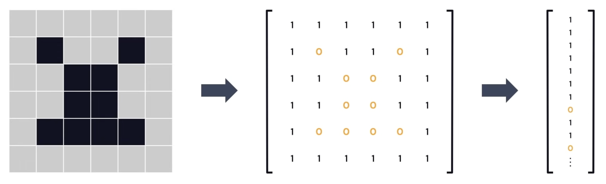
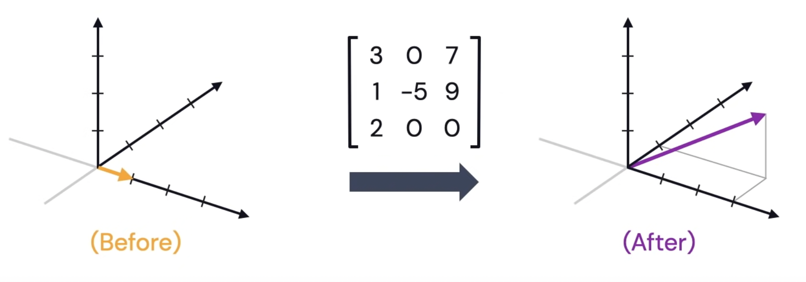
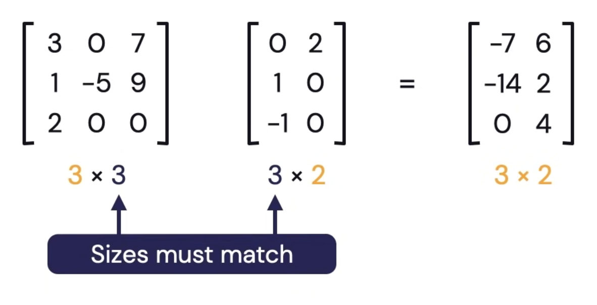
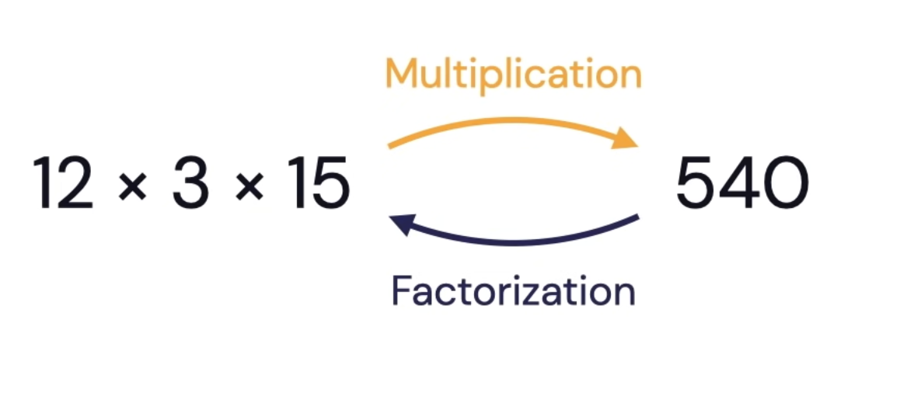
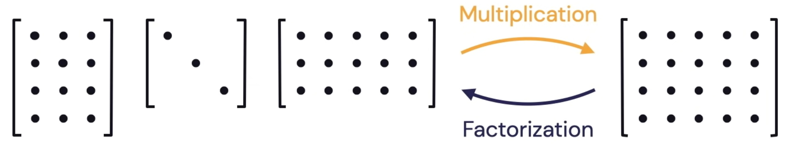
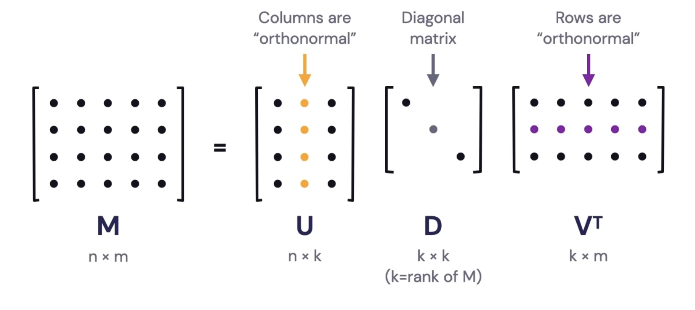

# Linear Algebra for Machine Learning

[youtube video](https://www.youtube.com/watch?v=LlKAna21fLE&t=57s)

## Data Representation

How can we represent data (images, text, user preference, etc.) in a way that computer can understand?

==idea==

Organize information into vector

A _vector_ is a 1-dimensional array of numbers. It has both a _magnitude_ (length) and a _direction_.

The totality of all vectors with $ n $ entries is an $ n $- dimensional vector space.

"$3$-dimensional space" consists of all vectors with $ 3 $ entries:

$$
\begin{bmatrix}
\quad*\quad\\*\\*
\end{bmatrix}
$$

### In the context of machine learning

==feature vector==

a vector whose entries represent the "features" of some object.

==feature space==

the vector space containing the feature vector, like vector space.

### Common Examples in machine learning

#### images

In black and white images, black and white pixels correspond to $ 0s $ and $ 1s $. Grayscale pixels are numbers between $ 0 $ and $ 255 $. Both assemble into a $ 1 $-dimensional array of numbers.

  

#### Words and Documents

Given a collection of documents, assign to every word a vector whose $ i ^{th} $ entry is th number of times the word appears in the $  i ^{th} $ document

$$
dog = \begin{bmatrix}
0\\7\\0\\0\\ \dots
\end{bmatrix}
$$

#### Yes/No or Ratings

Given users and items, vectors can indicate if a user has integrated with the item ($ 1 = yes, 2 = no$)

### Some drawbacks to consider

- These vectors can be very sparse
  - A "sparse" vector is one with lots of zeros
- Possible lack of **meaningful relationship between** vectors
  - one-hot encodings are never "similar"
  - similarity is measured by the **dot product**

### dot product

multiply vectors

$$
\begin{bmatrix}
2 \\ 1
\end{bmatrix}
\cdot
\begin{bmatrix}
1 \\ 5
\end{bmatrix}
= 7
$$

$$
\begin{bmatrix}
1 \\ 0 \\ 3
\end{bmatrix}
\cdot
\begin{bmatrix}
7 \\ 2 \\ -1
\end{bmatrix}
= (1)(7) + (0)(2) + (3)(-1) = 4
$$

The dot product represents the length of the "shadow" of one vector along another.

### better vector representation?

## vector embedding

an embedding of a vector is another vector in a smaller dimensional space

$$
\text{Replace}
\begin{bmatrix}
*\\*\\*
\end{bmatrix}
\text{with}
\begin{bmatrix}
*\\*
\end{bmatrix}
$$

### Talking about matrices

A **matrix** is a $ 2 $-dimensional array of numbers.
It represents a particular process of turning one vector into another: stretching, rotating, scaling, ...

A **matrix** represents a transformation of an entire vector space to another

  

#### what is a "matrix factorization"

We can multiply **matrices** and get a **matrix**

  

##### factorization

  
  

==Every matrix can be factored!==

A fundamental theorem in linear algebra
**Singular Value Decomposition**

  

## Dimensionality Reduction

via eigenvectors

Recall that a matrix represents a transformation between vector spaces.
There are some transformations for which some vectors never change direction, but are only scaled.
These special vectors are called ==eigenvectors==.
The scaling factor is called and ==eigenvalue==.
