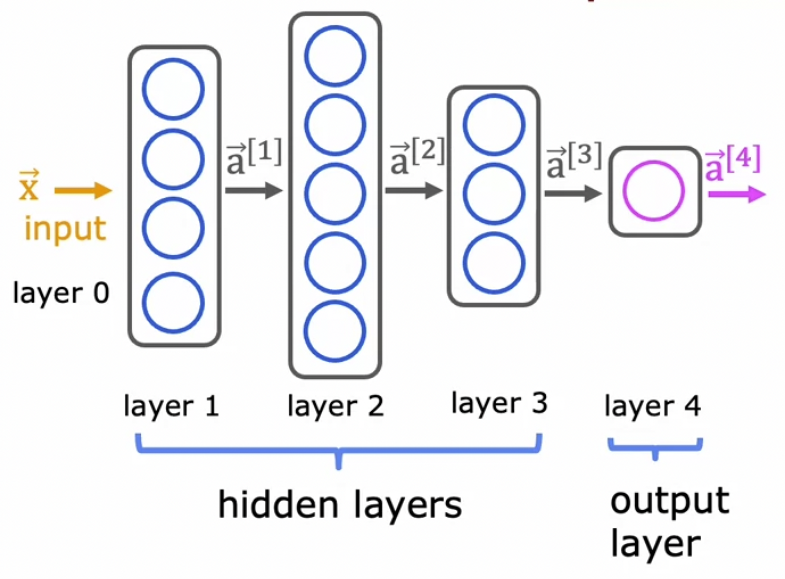

# Neural Network Intuition

<div style='padding-left: 9em; padding-right: 9em'>

</div>

## Layer

$$
\begin{align*}
a _{j} ^{[l]} &= g(\vec{w} _{j} ^{[l]} \cdot \vec{a} ^{[l-1]} + b _{j} ^{[l]})\\
&\\
a _{j} ^{[l]}&: \text{activation value of layer } l \text{, unit(neuron) } j\\
\text{sigmoid } g(\vec{w} \cdot \vec{a}+ b) &: \text{activation function}\\
\vec{a} ^{[l-1]}&: \text{output of layer } l -1 \text{ previous layer}\\
\vec{w} _{j} ^{[l]}, b _{j} ^{[l]}&: \text{parameters } w \& b \text{ of layer }l \text{, unit }j
\end{align*}
$$

## Inference: making predictions (forward propagation)

data is represented as tensor (like matrix) in tensorflow
to convert a tensor into a numpy array

```python
a1.numpy()
```

## Vectorization

```python
x = np.array([200, 17])

W = np.array([
    [1, -3, 5 ],
    [-2, 4, -6]
    ])

b = np.array([-1, 1, 2])

def dense(a_in, W, b):
    a_out = np.zeros(units):
    for j in range(units):
        w = W[:,j]
        z = np.dot(w,x) + b[j]
        a[j] = g(z)
    return a_out
```

$ \Downarrow\Downarrow\Downarrow\Downarrow\Downarrow $

```python
x = np.array([[200, 17]])

W = np.array([
    [1, -3, 5 ],
    [-2, 4, -6]
    ])

b = np.array([[-1, 1, 2]])

def dense(A_in, W, B):
    Z = np.matmul(A_in, W) + B
    A_out = g(Z)
    return A_out
```
