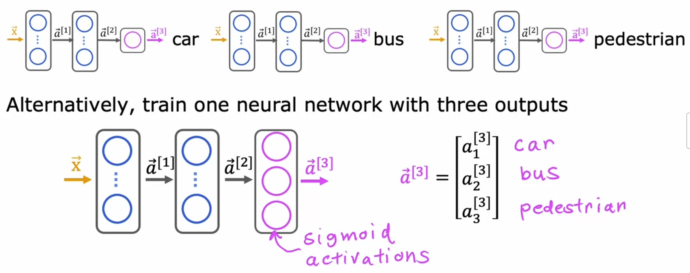

# Train Neural Network

**Different Activation Functions:**

$$
\begin{align*}
\text{Linear: } g(z) &= z\\
\text{Sigmoid: } g(z) &= \frac{1}{1 + e ^{-z}}\\
\text{ReLU: } g(z) &= max(0, z)
\end{align*}
$$

## Output Layer Activation Function

Binary classification: sigmoid?
Regression (negative/positive): linear?
Regression (positive only): ReLU?

## Hidden Layer Activation Function

ReLU is preferred

## Multiple Class Classification

### Softmax Regression

$$
\begin{align*}
z _{1} &= \vec{w} _{1} \cdot \vec{x} + b _{1}
\quad&\Rightarrow a _{1}&=
\frac{e ^{z _{1}}}{e ^{z _{1}}+e ^{z _{2}}+e ^{z _{3}}+e ^{z _{4}}}\\
&&&=P(y=1|\vec{x})
\\\\
z _{2} &= \vec{w} _{2} \cdot \vec{x} + b _{2}
\quad&\Rightarrow a _{2}&=
\frac{e ^{z _{2}}}{e ^{z _{1}}+e ^{z _{2}}+e ^{z _{3}}+e ^{z _{4}}}\\
&&&=P(y=2|\vec{x})
\\\\
z _{3} &= \vec{w} _{3} \cdot \vec{x} + b _{3}
\quad&\Rightarrow a _{3}&=
\frac{e ^{z _{3}}}{e ^{z _{1}}+e ^{z _{2}}+e ^{z _{3}}+e ^{z _{4}}}\\
&&&=P(y=3|\vec{x})
\\\\
z _{4} &= \vec{w} _{4} \cdot \vec{x} + b _{4}
\quad&\Rightarrow a _{4}&=
\frac{e ^{z _{4}}}{e ^{z _{1}}+e ^{z _{2}}+e ^{z _{3}}+e ^{z _{4}}}\\
&&&=P(y=4|\vec{x})
\\\\
\end{align*}
$$

$ \Downarrow\Downarrow\Downarrow\Downarrow\Downarrow $

$$
\begin{align*}
z _{j} &= \vec{w} _{j} \cdot \vec{x} + b _{j} \quad j = 1, \dots, N\\
a _{j} &= \frac{e ^{z _{j}}}{\sum_{k=1}^{N} e ^{z _{k}}} = P(y = j|\vec{x})
\end{align*}
$$

### Cost Function for Softmax Regression

recall the loss for logistic regression

$$
\begin{align*}
z &= \vec{w}\cdot \vec{x} + b\\
a _{1} &= g(z) = \frac{1}{1 + e ^{-z}} = P(y=1|\vec{x})\\
a _{2} &= 1 - a _{1} = P(y=0|\vec{x})\\
\text{loss} &= - y \log a _{1} - (1-y)  \log (1 - a _{1})\\
J(\vec{w}, b) &= \text{average loss}
\end{align*}
$$

**cost function for softmax regression**:

$$
\text{loss}(a _{1}, \dots, a _{N}, y) =
\begin{cases}
-\log a _{1}\quad \text{if } y = 1\\
-\log a _{2}\quad \text{if } y = 2\\
\quad\vdots\\
-\log a _{N}\quad \text{if } y = N
\end{cases}
$$

**cost**:

$$
\begin{align*}
1 \left\{ y==n \right\} &==
\begin{cases}
1,& \text{ if }& y ==n &\\
0,& \text{ otherwise}& &
\end{cases}
\\
J(\boldsymbol{W}, b) &= -
\left[
\sum_{i=1}^{m}\sum_{j=1}^{N} 1 \left\{ y ^{(i)} == j \right\}
\log \frac{e ^{z ^{(i)} _{j}}}{\sum_{k=1}^{N} e ^{z ^{(i)}}}
\right]
\end{align*}
$$

`SparseCategoricalCrossentropy()`

### Neural Network with Softmax output

More numerically accurate implementation of logistic loss:

`model.compile(loss=SparseCrossEntropy(from_logits=True))`

## Multi-label Classification

  
