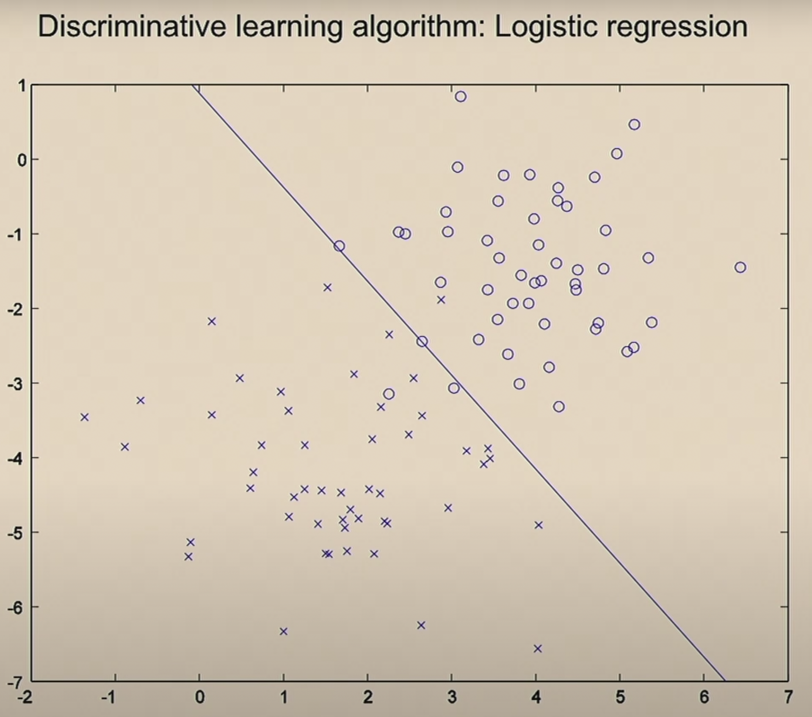
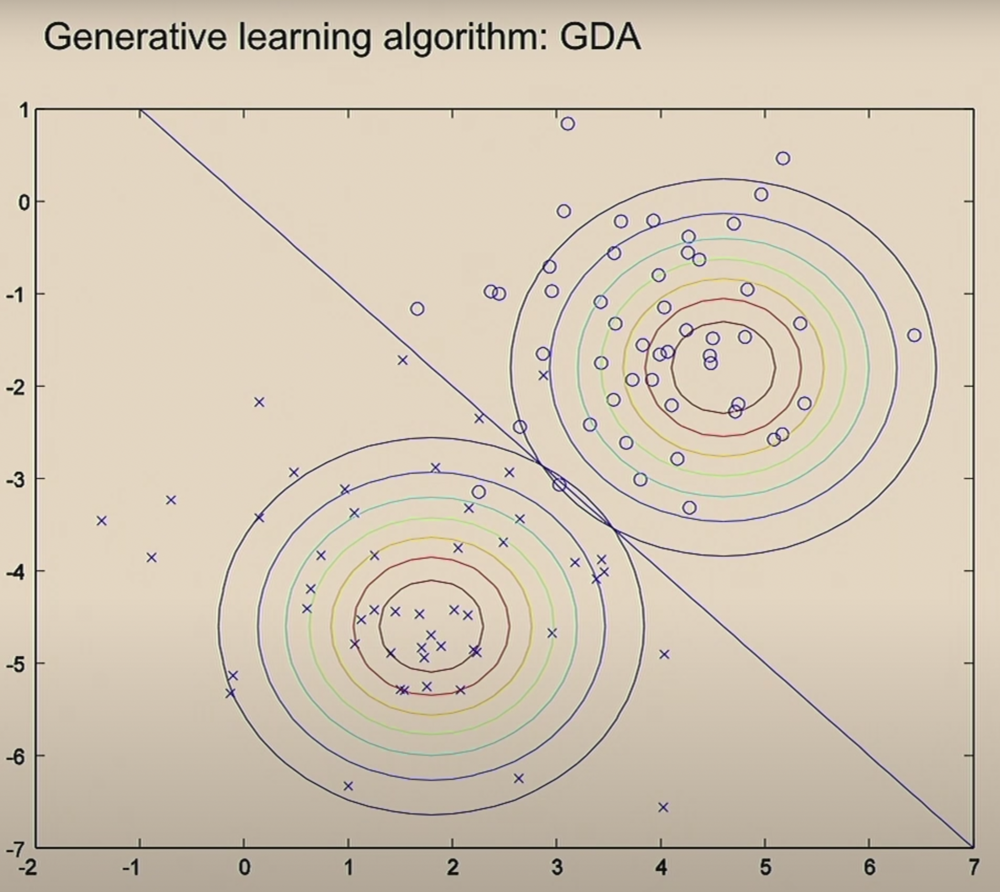

# Generative Learning Algorithm

- Gaussian Discriminant Analysis (GDA)
- Generative vs. Discriminative
- Native Bayes

Discriminative algorithm is searching for separation
Generative algorithm is searching for distribution (how each class looks like)
$ \rightarrow $ for a new dataset, the algorithm compares it with each class and try to find the one that matches more closely

==Discriminative:==
$$
\begin{align*}
&\text{learn } p(y|x)\quad x \rightarrow y\\
&\left(
\text{learn } h _{\theta}(x)=
\begin{cases}
0\\
1
\end{cases}
\text{ directly}
\right)
\end{align*}
$$

==Generative:==
$$
\begin{align*}
&\text{learn } p(x|y)\\
&\text{what the features like given the class}\\
&\underbrace{ p(y) }_{\text{class prior}}
\end{align*}
$$

Bayes rule:
$$
\begin{align*}
p(y=1|x) &= \frac{p(x|y=1)p(y=1)}{p(x)}\\
p(x) &= p(x|y=1)p(y=1)+p(x|y=0)p(y=0)
\end{align*}
$$

goal: learn $ p(y=1|x) $
input: $ p(x|y), p(y) $

## Gaussian Discriminant Analysis

Suppose
$$
x \in \mathbb{R}^{n} \quad \text{(drop } x _{0}=1 \text{)}
$$

Assume $ p(x|y) $ is Gaussian

$$
\begin{align*}
z &\sim N (\vec{\mu}, \Sigma)\\
z &\in \mathbb{R}^{n}\\
\vec{\mu}&\in \mathbb{R}^{n}\\
\Sigma&\in \mathbb{R}^{n \times n}\\
E \left[ z \right] &= \mu&\\
\text{Cov}(z) &= E \left[ (z-\mu)(z-\mu)^{\top} \right]&\\
&= E _{zz ^{\top}}-(E _{z})(E _{z}) ^{\top}\\
E \left[ z \right] &= E _{z}
\end{align*}
$$

Probability density function

$$
p(z) =
\frac{1}{(2\pi) ^{\frac{n}{2}}\left| \Sigma \right| ^{\frac{1}{2}}}
\exp \left(- \frac{1}{2}(x-\mu) ^{\top}\Sigma ^{-1}(x-\mu)\right)
$$

the $ \Sigma $ covariance matrix is always symmetric

[Plot for Gaussian Distribution](GaussianDistributionPlot.md)
[More about Gaussian Distribution](GaussianDistribution.md)

GDA model:

$$
\begin{align*}
p(x|y=0) &=
\frac{1}{(2\pi) ^{\frac{n}{2}}\left| \Sigma \right| ^{\frac{1}{2}}}
\exp \left(- \frac{1}{2}(x-\mu _{0}) ^{\top}\Sigma ^{-1}(x-\mu _{0})\right)\\
p(x|y=1) &=
\frac{1}{(2\pi) ^{\frac{n}{2}}\left| \Sigma \right| ^{\frac{1}{2}}}
\exp \left(- \frac{1}{2}(x-\mu _{1}) ^{\top}\Sigma ^{-1}(x-\mu _{1})\right)\\
&\text{ we usually assume } \Sigma \text{ are the same}\\
p(y) &= \phi ^{y} (1 - \phi) ^{1-y}\quad (p(y=1) = \phi)\\
&\text{Parameters for this model: }\mu _{0}, \mu _{1}, \Sigma,\phi\\
\end{align*}
$$

- $ \mu _{0}, \mu _{1} \in \mathbb{R}^{n} $
- $ \Sigma \in \mathbb{R}^{n \times n} $
- $ \phi \in \mathbb{R} $ (real number)

## Fit the parameters

Training set
$$
\left\{ \left( x ^{(i)}, y ^{(i)} \right) \right\} _{i=1} ^{m}
$$

we need to maximize the Joint likelihood
$$
\begin{align*}
L(\phi, \mu _{0}, \mu _{1}, \Sigma) &=
\prod _{i=1} ^{m}
p( x ^{(i)}, y ^{(i)}; \phi, \mu _{0}, \mu _{1}, \Sigma)\\
&=
\prod _{i=1}^{m} p(x ^{(i)}| y ^{(i)})p(y ^{(i)})
\end{align*}
$$

Recall that for Discriminative algorithm, we are maximizing the conditional likelihood
$$
L(\theta) = \prod _{i=1} ^{m} p(y ^{(i)}| x ^{(i)}; \theta)
$$

**Maximum likelihood estimation**:
$$
\max _{\phi, \mu _{0}, \mu _{1}, \Sigma} l(...)
$$

the closed form function is

$$
\begin{align*}
\phi &= \frac{\sum _{i=1} ^{m} y ^{(i)}}{m}\\
&=\frac{\sum _{i=1} ^{m}1\left\{ y ^{(i)}=1 \right\}}{m}\\
\mu _{0} &=
\frac{\sum_{i=1}^{m}1\left\{ y ^{(i)} =0 \right\} x ^{(i)}}
{\sum_{i=1}^{m}1 \left\{ y ^{(i)} = 0 \right\}}\\
\mu _{1} &=
\frac{\sum_{i=1}^{m}1\left\{ y ^{(i)} =1 \right\} x ^{(i)}}
{\sum_{i=1}^{m}1 \left\{ y ^{(i)} = 1 \right\}}\\
\Sigma &=
\frac{1}{m} \sum_{i=1}^{m}
(x ^{(i)}- \mu _{y ^{(i)}})
(x ^{(i)}-\mu _{y ^{(i)}})^{\top}
\end{align*}
$$

> To derive the representation of a malignant tumor $ p(y = 1|x) $
>
> for $ \phi $, you can think of the fraction of malignant tumors in the training set
>
> for $ \mu _{0} $, you can think in this way: what is the maximum likelihood estimator for the mean of all the features for benign tumors? It is pretty reasonable to pick all benign tumor in the training set and take the mean.
> In this case the denominator is the total number of benign tumors
> The numerator is summing up all the feature vectors in the training set that are benign

indicator notation
$$
\begin{align*}
1 \left\{ true \right\} &= 1\\
1 \left\{ false \right\} &= 0
\end{align*}
$$

## To make a prediction

> $ \Downarrow $ given the new data, which class does it's feature more likely to belong to? $ \Downarrow $
> $ y=0 $ or $ y=1 $ ?

$$
\begin{align*}
\text{argmax } _{y}p(y|x) &= \text{argmax } _{y} \frac{p(x|y)p(y)}{p(x)}\\
&= \text{argmax } _{y} p(x|y)p(y)\quad\quad (p(x)\text{ is constant })\\
&= \text{argmax } _{y} p(x|y)p(y)
\end{align*}
$$

**Notation**:
$$
\begin{align*}
\min _{z}(z-5)^{2} &= 0\\
\text{argmin } _{z}(z-5)^{2} &= 5\\
\end{align*}
$$

## Compare Discriminative vs. Generative

==discriminative==
  
==generative==
  

> Use a single $ \Sigma $ covariance matrix gives a linear decision boundary.
> It is also reasonable to use different $ \Sigma _{0}, \Sigma _{1} $ though.

## Compare GDA to Logistic Regression

The mechanics behind both Logistic Regression and Gaussian Discriminant Analysis is sigmoid function.

GDA makes a stronger assumption (data are Gaussian distributed), you can prove Logistic Regression from Gaussian Discriminant Analysis, the opposite direction is not true.

GDA will perform better when the assumption is roughly true (Gaussian distributed data). When the assumption is wrong, it performs poorly.

> When you know nothing about the distribution of your dataset, logistic regression will serve as a robust algorithm.

## Naive Bayes

Feature vector $ x $?
$$
\begin{align*}
&x \in \left\{ 0, 1 \right\} ^{n}\\
&x _{i} = 1 \left\{ \text{word } i \text{ appears in email} \right\}
\end{align*}
$$

We want to model $ p(x|y), p(y) $
There are $ 2 ^{10000} $ possible value of $ x $

Assume $ x _{i}s $ are conditionally independent given y
$$
\begin{align*}
p(x,\dots,x _{10000}|y) &= p(x _{1}|y)p(x _{2}|y)\dots p(x _{10000}|y)\\
&=\prod _{i=1} ^{n} p(x _{i}|y)
\end{align*}
$$

Parameters
$$
\begin{align*}
\phi _{j|y=1} &= p(x _{j} = 1| y = 1)\\
\phi _{j|y=0} &= p(x _{j} = 0| y = 0)\\
\phi _{y} &= p(y=1)
\end{align*}
$$

Joint likelihood:
$$
\begin{align*}
L(\phi _{y}, \phi _{j|y}) &=
\prod _{i=1} ^{m} p(x ^{(i)}, y ^{(i)}; \phi _{y}, \phi _{j|y})\\
MLE:\\
\phi _{y} &= \frac{\sum_{i=1}^{m}1 \left\{ y ^{(i)}=1 \right\}}{m}\\
\phi _{j|y=1} &=
\frac{\sum_{i=1}^{m}1 \left\{ x ^{(i)} _{j} = 1, y ^{(i)} =1 \right\}}
{\sum_{i=1}^{m}1 \left\{ y ^{(i)}=1  \right\}}
\end{align*}
$$
