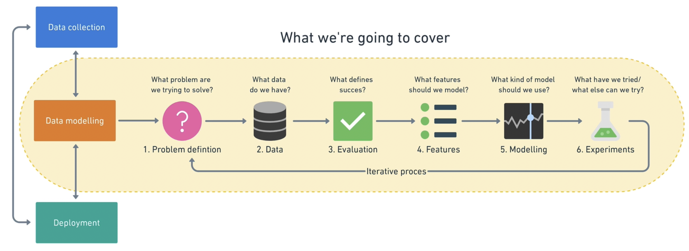

# Step Machine Learning Framework

  

1. Problem definition
2. Data
3. Evaluation
4. Features
5. Modeling
6. Experimentation

## Problem definition

> what problem are we trying to solve?

Main types of machine learning:

- supervised learning
  - data & label
  - classification & regression
- unsupervised learning
  - data (no label)
- transfer learning
- reinforcement learning

## Types of data

- structured
- unstructured
and
- static
- streaming

## Evaluation

> what defines success for us

## Features

> what do we already know about the data

## Modeling

three parts to modeling

- choosing and training a model
- tuning a model
- model comparison

### underfitting & overfitting

All experiments should be conducted on different portions of your data.

- Training data set — Use this set for model training, 70–80% of your data is the standard.
- Validation/development data set — Use this set for model hyperparameter tuning and experimentation evaluation, 10–15% of your data is the standard.
- Test data set — Use this set for model testing and comparison, 10–15% of your data is the standard.

Poor performance on training data $\Rightarrow$ underfitting.
Try a different model, improve the existing one through hyperparameter or collect more data.

Great performance on the training data but poor performance on test data $\Rightarrow$ overfitting the training data.
Try using a simpler model or making sure your the test data is of the same style your model is training on.

Another form of overfitting can come in the form of better performance on test data than training data. This may mean your testing data is leaking into your training data (incorrect data splits) or you've spent too much time optimizing your model for the test set data.

## Experimentation
