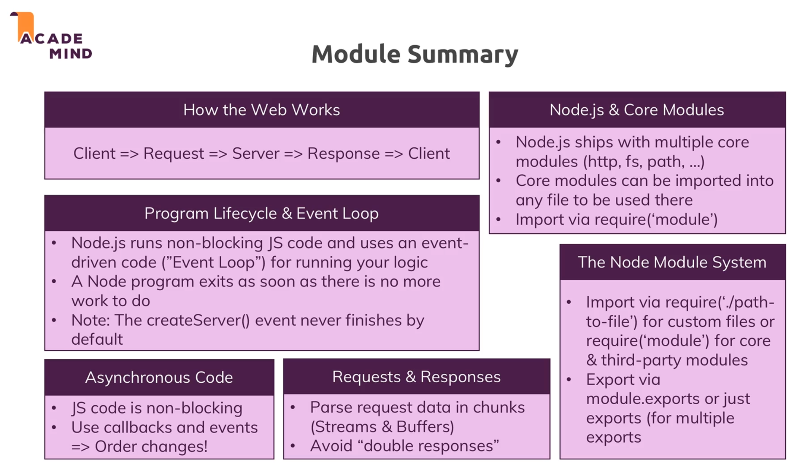

# Understanding Basics

## Core Modules

- `http`: Launch a server, send requests
- `https`: Launch a SSL server
- `fs`
- `path2022SummerVacation`
- `os`

## `require`

The build in `require` function is the easiest way to include modules that exist in separate files.
The basic functionality of `require` is that it reads a Javascript file, executes the file, and then proceeds to return the `exports` object.

==Example==

myfirstmodule.js

```javascript
myDataTime = function () {
    return Date();
};

module.export = {
    myDataTime,
}
```

```javascript
const dt = require('./myfirstmodule);
dt.myDataTime();
```

## Creating a node server

```javascript
const http = require('http');

const server = http.createServer((request, response) => {
    console.log(request);
});

server.listen(3000);
```

## Sending Responses

```javascript
const http = require('http');

const server = http.createServer((request, response) => {
    console.log(
        request.url,
        request.method,
        request.headers
    );
    response.setHeader('Content-Type', 'text/html');
    response.write('<html>');
    response.write('<head><title>My First Page</title></head>');
    response.write('<body><h1>Hello from my Node.js Server!</h1></body>');
    response.write('</html>');
    response.end();
});

server.listen(3000);
```

## Request & Response Headers

[mozilla documentation](https://developer.mozilla.org/en-US/docs/Web/HTTP/Headers)

HTTP headers let the client and the server pass additional information with an HTTP request or response.

## kill port process

[kill port](https://remarkablemark.org/blog/2016/06/06/kill-used-port/)

```bash
$ lsof -ti :$PORT
# get the process id

$ kill $(lsof -ti :$PORT)
# kill the process associated with the port
```

## Parsing Request Bodies

```javascript
const http = require('http');
const fs = require('fs');

const server = http.createServer((request, response) => {
    const url = request.url;
    const method = request.method;
    if (url === '/') {
        response.write('<html lang="en">');
        response.write('<head><title>Enter Message</title></head>');
        response.write('<body><form action="/message" method="POST"><input type="text" name="message"><button type="submit">Send</button></form></body>');
        response.write('</html>');
        return response.end();
    }
    if (url === '/message' && method === 'POST') {
        const body = [];
        request.on('data', (chunk) => {
            console.log(chunk);
            body.push(chunk);
        });
        request.on('end', () => {
            const parsedBody = Buffer.concat(body).toString();
            console.log(parsedBody);
            const message = parsedBody.split('=')[1];
            fs.writeFile('message.txt', message, (err) => {
                if (err) {
                    console.log(err);
                }
            });
        });
        response.statusCode = 302;
        response.setHeader('Location', '/');
        return response.end();
    }
    response.setHeader('Content-Type', 'text/html');
    response.write('<html lang="en">');
    response.write('<head><title>My First Page</title></head>');
    response.write('<body><h1>Hello from my Node.js Server!</h1></body>');
    response.write('</html>');
    response.end();
});

server.listen(3000);
```

## Using node Modules System

### routes.js

```javascript
const fs = require('fs');

const requestHandler = (request, response) => {
    const {url, method} = request;
    if (url === '/') {
        response.write('<html lang="en">');
        response.write('<head><title>Enter Message</title></head>');
        response.write('<body><form action="/message" method="POST"><input type="text" name="message"><button type="submit">Send</button></form></body>');
        response.write('</html>');
        return response.end();
    }
    if (url === '/message' && method === 'POST') {
        const body = [];
        request.on('data', (chunk) => {
            console.log(chunk);
            body.push(chunk);
        });
        request.on('end', () => {
            const parsedBody = Buffer.concat(body).toString();
            console.log(parsedBody);
            const message = parsedBody.split('=')[1];
            fs.writeFile('message.txt', message, (err) => {
                if (err) {
                    console.log(err);
                }
            });
        });
        response.statusCode = 302;
        response.setHeader('Location', '/');
        return response.end();
    }
};

module.exports = {
    requestHandler,
}
```

### app.js

```javascript
const http = require('http');
const routes = require('./routes');
// ./ indicates that routes is a local module

const server = http.createServer(routes.requestHandler);

server.listen(3000);
```

## Wrap up

`Client` $\Rightarrow$ `Request` $\Rightarrow$ `Server` $\Rightarrow$ `Response` $\Rightarrow$ `Client`

  
